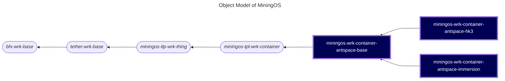

# miningos-wrk-container-antspace

A worker service for managing Antspace cooling containers in MiningOS. This service provides APIs to monitor and control HK3 and Immersion cooling systems.

## Table of Contents

1. [Overview](#overview)
2. [Object Model](#object-model)
3. [Worker Types](#worker-types)
4. [Requirements](#requirements)
5. [Installation](#installation)
6. [Configuration](#configuration)
7. [Running the Worker](#running-the-worker)
8. [API Documentation](#api-documentation)
9. [Alert System](#alert-system)
10. [Mock Server](#mock-server)
11. [Testing](#testing)
12. [Development](#development)
13. [Troubleshooting](#troubleshooting)

## Overview

The Antspace container worker provides a unified interface for managing different types of cooling containers used in cryptocurrency mining operations. It supports real-time monitoring, temperature control, and alert management for both HK3 and Immersion cooling systems.

### Key Features

- Real-time monitoring of cooling system parameters
- Temperature control and system management
- Comprehensive alert system for fault detection
- Mock server for development and testing
- Support for multiple container types

## Object Model

The following is a fragment of [MiningOS object model](https://docs.mos.tether.io/) that contains the concrete class representing **Antspace Container workers** (highlighted in blue). The rounded nodes reprsent abstract classes and the square nodes represents a concrete classes:



Check out [miningos-tpl-wrk-container](https://github.com/tetherto/miningos-tpl-wrk-container) for more information about parent classes.

## Worker Types

The system supports two container types (the two rightmost child classes highlighted in the diagram above):

- **`wrk-container-rack-hk3`** - For HK3 cooling containers with cooling tower systems
- **`wrk-container-rack-immersion`** - For immersion cooling containers with dry cooler systems

## Requirements

- Node.js >= 20.0

## Configuration

### Configuration Files Structure

```
config/
├── base.thing.json      # Container monitoring and alert configuration
├── common.json          # Common settings (logging, debug)
└── facs/               # Facility-specific configurations
    ├── miningos-net.config.json
    ├── net.config.json
    └── store.config.json
```

### Key Configuration Parameters

#### base.thing.json
- `collectSnapTimeoutMs`: Timeout for collecting snapshots (default: 120000ms)
- `collectSnapsItvMs`: Interval for collecting snapshots (default: 60000ms)
- `logRotateMaxLength`: Maximum log file length before rotation (default: 10000)
- `logKeepCount`: Number of log files to keep (default: 3)
- `alerts`: Container-specific alert definitions with severity levels

#### common.json
- `dir_log`: Directory for log files (default: "logs")
- `debug`: Debug level (0 = off, 1 = on)

### Alert Severity Levels

- **critical**: Immediate attention required (e.g., leakage, pump failures)
- **high**: Significant issues requiring prompt attention
- **medium**: Issues that need monitoring but not immediate action


## Installation

1. Clone the repository:
```bash
git clone https://github.com/tetherto/miningos-wrk-container-antspace.git
cd miningos-wrk-container-antspace
```

2. Install dependencies:
```bash
npm install
```

3. Set up configuration files:
```bash
./setup-config.sh
```

## Running the Worker

### Starting the Worker Service

For HK3 container:
```bash
node worker.js --wtype wrk-container-rack-hk3 --env development --rack 1
```

For Immersion container:
```bash
node worker.js --wtype wrk-container-rack-immersion --env development --rack 2
```

### Registering a Container

After starting the worker, register a container using the RPC client:

```bash
hp-rpc-cli -s wrk-as -m registerThing -d '{"info":{"container":"bitmain-imm-1"},"opts":{"address":"127.0.0.1","port":8000}}'
```

Parameters:
- `info.container`: Container identifier
- `opts.address`: IP address of the container
- `opts.port`: Port number for container communication

## API Documentation

The worker exposes several APIs for container management. See [docs/antspace.md](./docs/antspace.md) for detailed API documentation.

### Core Functions

#### Control Operations
- `switchCoolingSystem(enabled)` - Enable/disable the cooling system
- `resetCoolingSystem()` - Reset the cooling system
- `setLiquidSupplyTemperature(temperature)` - Set target supply temperature

#### Monitoring Operations
- `getSystemData()` - Retrieve complete system data
- `getMinerInfo()` - Get miner information
- `getConfig()` - Get current configuration
- `getInfo()` - Get container information
- `getStats()` - Get current statistics
- `getSnap()` - Get a complete snapshot of the container state

### Notable Parameters Available in API Responses

#### HK3 Container
Monitors cooling tower systems with parameters including:
- Supply/return liquid temperature and pressure
- Cooling tower fan status (3 fans)
- Spray pump and fluid infusion pump status
- Liquid flow rates and levels

#### Immersion Container
Monitors dry cooler systems with parameters including:
- Secondary circulation pump status
- Dry cooler power frequency
- Power distribution box temperature
- Liquid level sensors

### RPC API

The Antspace container worker exposes RPC methods through a multi-layered inheritance system. RPC functionality is inherited from `miningos-tpl-wrk-thing` through `miningos-tpl-wrk-container`.

#### Architecture

```
┌─────────────┐     RPC      ┌──────────────┐     HTTP      ┌───────────────┐
│  RPC Client ├─────────────►│    Worker    ├──────────────►│   Container   │
│ (hp-rpc-cli)│              │   Service    │               │   Hardware    │
└─────────────┘              └──────────────┘               └───────────────┘
```

#### Service Access

- **Service name**: `wrk-as`
- **Worker types**: 
  - `wrk-container-rack-hk3`
  - `wrk-container-rack-immersion`

#### RPC Methods

##### Core Methods

###### `registerThing`
Registers a container with the worker service.

```bash
hp-rpc-cli -s wrk-as -m registerThing -d '{"info":{"container":"bitmain-imm-1"},"opts":{"address":"127.0.0.1","port":8000}}'
```

**Parameters:**
- `info.container`: Container identifier
- `opts.address`: Container IP address  
- `opts.port`: Container port

###### `listThings`
Lists all registered containers.

```bash
hp-rpc-cli -s wrk-as -m listThings -d '{"status":true}'
```

**Parameters:**
- `status` (optional): Include last snapshot data
- `offset` (optional): Pagination offset
- `limit` (optional): Results limit (default: 100)

###### `queryThing`
Executes a method on a specific container.

```bash
hp-rpc-cli -s wrk-as -m queryThing -d '{"id":"bitmain-imm-1","method":"getStats","params":[]}'
```

**Parameters:**
- `id`: Container ID
- `method`: Method name to execute
- `params`: Method parameters

###### `applyThings`
Executes the same action on multiple containers.

```bash
hp-rpc-cli -s wrk-as -m applyThings -d '{"method":"resetCoolingSystem","query":{"tags":{"$in":["t-container"]}}}'
```

**Parameters:**
- `method`: Action to execute
- `query` (optional): MongoDB-style filter
- `params` (optional): Method parameters

**Available Actions (Antspace-specific):**
- `resetCoolingSystem`
- `setLiquidSupplyTemperature`

###### `updateThing`
Updates container configuration.

```bash
hp-rpc-cli -s wrk-as -m updateThing -d '{"id":"bitmain-imm-1","info":{"location":"rack-2"}}'
```

**Parameters:**
- `id`: Container ID
- `info` (optional): Info to update
- `opts` (optional): Options to update
- `forceOverwrite` (optional): Replace instead of merge

###### `forgetThings`
Removes containers from management.

```bash
hp-rpc-cli -s wrk-as -m forgetThings -d '{"query":{"id":{"$in":["bitmain-imm-1"]}}}'
```

**Parameters:**
- `query`: MongoDB-style filter
- `all` (optional): Remove all containers

##### Monitoring Methods

#### `tailLog`
Retrieves historical data logs.

```bash
hp-rpc-cli -s wrk-as -m tailLog -d '{"key":"stat-5m","tag":"t-container","limit":100}'
```

**Parameters:**
- `key`: Log key (e.g., "stat-5m", "stat-1h")
- `tag`: Tag to filter
- `limit` (optional): Number of entries
- `start` (optional): Start timestamp
- `end` (optional): End timestamp

###### `getRack`
Gets rack information.

```bash
hp-rpc-cli -s wrk-as -m getRack
```

**Returns:**
- `id`: Rack identifier
- `rpcPubKey`: RPC public key

##### Utility Methods

###### `echo`
Tests RPC connectivity.

```bash
hp-rpc-cli -s wrk-as -m echo -d '"test"'
```

#### Error Responses

Common errors:
- `ERR_THING_NOTFOUND`: Container not registered
- `ERR_METHOD_INVALID`: Invalid method name
- `ERR_THING_NOT_INITIALIZED`: Container not connected
- `ERR_SLAVE_BLOCK`: Operation not allowed on replica

#### Example Workflow

```bash
# 1. Start worker
node worker.js --wtype wrk-container-rack-hk3 --env development --rack 1

# 2. Register container
hp-rpc-cli -s wrk-as -m registerThing -d '{"info":{"container":"hk3-001"},"opts":{"address":"192.168.1.100","port":8000}}'

# 3. List containers
hp-rpc-cli -s wrk-as -m listThings

# 4. Query specific container
hp-rpc-cli -s wrk-as -m queryThing -d '{"id":"hk3-001","method":"getStats","params":[]}'

# 5. Apply action to all HK3 containers
hp-rpc-cli -s wrk-as -m applyThings -d '{"method":"setLiquidSupplyTemperature","params":[22],"query":{"tags":{"$in":["t-container-rack-hk3"]}}}'

# 6. View historical data
hp-rpc-cli -s wrk-as -m tailLog -d '{"key":"stat-5m","tag":"t-container","limit":10}'
```

## Alert System

The system includes comprehensive alert monitoring for various fault conditions:

### Common Alerts
- Power faults
- Pump failures (circulating, spray, fluid infusion)
- Fan malfunctions
- Temperature anomalies
- Pressure issues
- Flow rate problems
- Leakage detection

### Container-Specific Alerts

**HK3 Additional Alerts:**
- Cooling tower liquid level
- Freezing conditions
- Cooling tower fan faults (3 fans)

**Immersion Additional Alerts:**
- Phase failures
- Sensor faults (temperature, level, smoke)
- Power distribution faults
- Frequency conversion issues

## Mock Server

For development and testing, use the mock server:

```bash
# Basic usage
node mock/server.js --type HK3 -p 8000 -h 0.0.0.0

# With error simulation
node mock/server.js --type HK3 -p 8000 -h 0.0.0.0 --error
```

### Mock Server Options
- `--type`: Container type (HK3 or IMMERSION) - **required**
- `-p, --port`: Port number (default: 8000)
- `-h, --host`: Host address (default: 127.0.0.1)
- `--error`: Enable error response simulation
- `--bulk`: Load multiple containers from a JSON file

## Testing

Run the test suite:
```bash
npm run test
```

### Debug Mode

```bash
DEBUG=* node worker.js --wtype wrk-container-rack-hk3 --env development --rack 1
```
